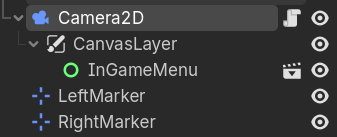

# Camera

## Node Tree

The node tree has the following nodes relating to the camera:
- Camera2D: the camera itself with a CanvasLayer child node to contain the InGameMenu so the menu stays in place. 
- LeftMarker and RightMarker: borders to where the camera can move
<br>
<br>

 

## Start of game

- The camera gets the screen_width and edge_margin
- Adds a signal to get_viewport() when it's size changes to update both variables
- Adds both the left and right markers, which function as limits for how left and right the camera can scroll

```
func _ready() -> void:
	_update_screen_size()
	get_viewport().size_changed.connect(_update_screen_size)
	if left_marker:
		left_limit = left_marker.global_position.x
	if right_marker:
		right_limit = right_marker.global_position.x
```

## During Game

- Gets the mouse's current coordinates for the x axis
- Checks if the mouse's x coordinates are inside the edge margin. If yes it moves the camera on the x axis based on how close it is to that side of the screen by updating the camera's global_position.x coordinates

```
func _process(delta: float) -> void:
	mouse_x = get_viewport().get_mouse_position().x / get_viewport().get_final_transform().get_scale().x
	
	if mouse_x < edge_margin:
		var strength = 1.0 - (mouse_x / edge_margin)
		global_position.x -= pan_speed * strength * delta
	elif mouse_x > screen_width - edge_margin:
		var strength = (mouse_x - (screen_width - edge_margin)) / edge_margin
		global_position.x += pan_speed * strength * delta
	global_position.x = clamp(global_position.x, left_limit, right_limit)
```
