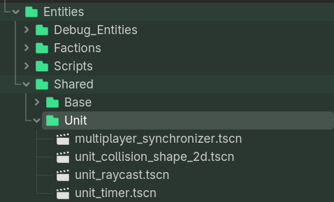
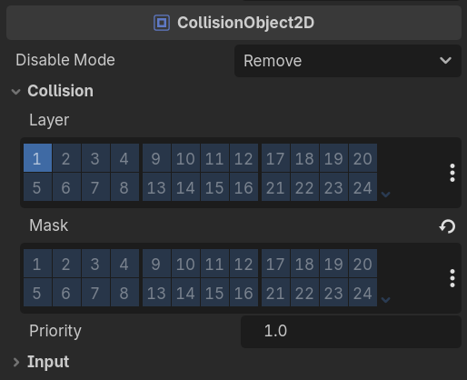
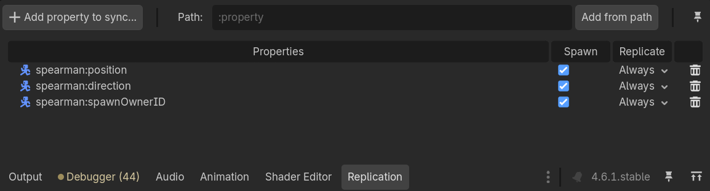

# How to create units

## 1. Go to Entities folder

1.1 Find the folder with the faction the unit belongs to

1.2 Create folder with the unit's name


## 2. Create a new scene

2.1 Go to Scene > New Scene

2.2 Search for the CharacterBody2D node and click create


## 3. CharacterBody2D 

3.1 Name the CharacterBody2D after the unit

3.2 Click CharacterBody2D > Go to Inspector > Script > New Script

3.3 Delete everything in the new script and replace it with this:


```
extends Unit

func _init() -> void:
	pass

func _process(delta: float) -> void:
	# Only host processes this
	if !is_multiplayer_authority():
		return
```

NOTE: You will have to write more in _process for units with special abilities


## 4. Child Nodes

4.1 Go to: Entities > Shared > Unit > Select all the files and add them as child nodes to the CharacterBody2D

multiplayer_synchronizer - Syncs the unit in multiplayer game

unit_collision_shape_2d - The hurtbox e.g  what needs to be collide with the raycast for a unit to take damage

unit_raycast - How far the unit reaches for it's attack

unit_timer - Cooldown timer between each attack


<br>
<br>
3.4 Select CharacterBody2D > Go to Inspector

&emsp;3.4.1 Find the Hitbox > Set it to be unit_raycast

&emsp;3.4.2 Find the Hitbox > Set it to be unit_timer

&emsp;3.4.5 Scroll to Collision section and match the image:


<br>

This is so units don't collide with one another so they stack together

<br>
3.5 Select MultiplayerSynchronizer

&emsp;3.5.1 Go into the bottom and select Replication

&emsp;3.5.2 Click "Add property to synchronize"

&emsp;3.5.3 Select the CharacterBody2D, and add the following:
	position
	direction
	spawnOwnerID

&emsp;(Or copy paste the MultiplayerSynchronizer from an existing unit)

<br>

&emsp;That unit should have these values appear in the Replication window:
<br>
&emsp;

## 5. Customize

From here you can customize each unit based on what you want it's behavior to behaviour to be.

### Cheatsheet for customization

#### Change units range
Select unit_raycast, go to Target Position and increase x axis

#### Change attack cooldown
Select unit_timer, go to Wait Time and increase/decrease
